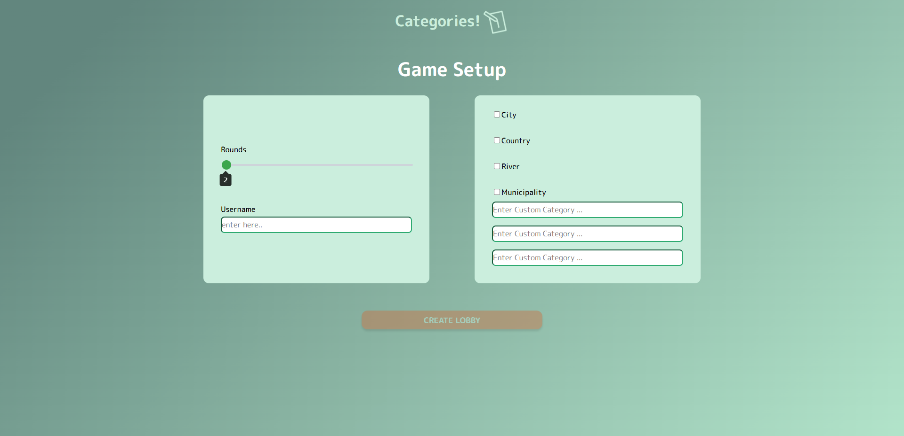

# Categories!
Welcome to our Project *Categories!*

## Introduction
Categories (“Stadt-Land-Fluss”) is a fun game which can be played by 2 or more players. There is an amount of rounds and some Categories which can be chosen individually. In each round a new random letter is set and every player has to find words for the specific categories which start with the given letter. As soon as a player submits all his answers for this letter the round will be closed for everyone. For each valid answer you will get a point. For the predefined categories the game will automatically validate each submitted answer. There is also the possibility for each player to vote for an invalid answer of someone else to be counted as valid in case the automatic validation is faulty. Also, the players vote for all answers submitted in custom categories. At the end all the points from each round will be added up and the 3 best players will be displayed.

### Main Goal
Everyone played “Stadt-Land-Fluss” as a child or still does now, with pen and paper and after every round we had to search online if some of those words do exist.
So we created an online version of the game called “Categories!”, where it doesn’t matter in which language you type in a word, it automatically checks for pre-defined categories if it is valid or not and even gives you a wikipedia link to check for yourself.

### Motivation
As a team we wanted to create a game everyone can play in their free time with many friends together. Categories is a game that almost everyone played at least once in a lifetime so it is very popular and it will be played for sure in the future. Our motivation was to combine the idea of a popular game with our challenge of developing it with our own imagination in order to expand our knowledge about software developing and creating a game everyone can profit from.

## Technologies

The Technologies we used in our client repository are the following:

- WebStorm as our IDE
- Git and GitHub for the project organization and version control
- Heroku for the deoplyment
- Sonarcloud for code quality
- Node.js as JavaScript runtime environment
## High-level components
Our main components of our frontend are the following:
- Views
- UI
- Routing

    ## Views:

    The Homepage view is the first thing a user sees. From there he can go to the Info view where he can read how the game is played. 

    Or he can create a new game, which leads to the next view, the Setup view. In this view the host can decide how many rounds and which categories should be played.

    


    After creating a lobby, the Lobby view gives you an invite link to send to friends, so they can join the game. New players will be sent to the NewPlayer view, where they have to choose a username to join the lobby. Players already in the lobby are shown at the left side. The settings of the game can still be changed by clicking on the "settings" button, which leads to the Settings view. New players can read through the game instruction by clicking on the info button which brings them to the Info view.

    


    When the host starts the game, all players go to the Game view, where they see the randomly picked letter and the answer fields.

    


    If one of the players presses on the "Send Answers!" button, the round ends for everyone and they get sent to the Result view, where they can see the answers of the other players and can vote if an invalid answer should still get points or not.

    


    If all rounds are played, the players get sent to the Endgame view, where they see who got the most points.

    


    At the bottom of the screen all answers are shown.

    


    ## UI:

    One of the important UI components is the Button. The most used one is the primary button, which is used as the basic button in almost all views.

    The other one is the Spinner, which we used as a loading animation.


    ## Routing:

    Our two routing components are RouteProtectors and Routers.


# Launch and deployment
In the following there are some important steps and prerequisites that you should have heard of in order to join and work on our project. This should help you to get started with our application.

## Getting started

Read and go through these Tutorials. It will make your life easier!

- Read the React [Docs](https://reactjs.org/docs/getting-started.html)
- Do this React [Getting Started](https://reactjs.org/tutorial/tutorial.html) Tutorial (it doesn’t assume any existing React knowledge)
- Get an Understanding of [CSS](https://www.w3schools.com/Css/), [SCSS](https://sass-lang.com/documentation/syntax), and [HTML](https://www.w3schools.com/html/html_intro.asp)!

Next, there are two other technologies that you should look at:

* [react-router-dom](https://reacttraining.com/react-router/web/guides/quick-start) offers declarative routing for React. It is a collection of navigational components that fit nicely with the application. 
* [react-hooks](https://reactrouter.com/web/api/Hooks) let you access the router's state and perform navigation from inside your components.

## Prerequisites and Installation
For your local development environment, you will need Node.js. You can download it [here](https://nodejs.org). All other dependencies, including React, get installed with:

```npm install```

Run this command before you start your application for the first time. Next, you can start the app with:

```npm run dev```

Now you can open [http://localhost:3000](http://localhost:3000) to view it in the browser.

Notice that the page will reload if you make any edits. You will also see any lint errors in the console (use Google Chrome).

### Testing
Testing is optional, and you can run the tests with `npm run test`.
This launches the test runner in an interactive watch mode. See the section about [running tests](https://facebook.github.io/create-react-app/docs/running-tests) for more information.

> For macOS user running into a 'fsevents' error: https://github.com/jest-community/vscode-jest/issues/423

### Build
Finally, `npm run build` builds the app for production to the `build` folder.<br>
It correctly bundles React in production mode and optimizes the build for the best performance: the build is minified, and the filenames include hashes.<br>

See the section about [deployment](https://facebook.github.io/create-react-app/docs/deployment) for more information.

## Learn More

To learn React, check out the [React documentation](https://reactjs.org/).


> Thanks to Lucas Pelloni and Kyrill Hux for working on the template.

## Roadmap
There are still many improvements possible to our game. Some of them are the following:
- Create a Live-Chat in between the rounds, so the players can interact with each other in order to discuss the answers & the voting.
- Getting extra points for unique and rare answers and/or for superfast answers.
- Make it possible to create and play in teams against each other.

## Authors and acknowledgment
### Authors
- Timothy-Till Näscher
- Witold Rozek
- Mohamed Islem Mdimagh

## License
This project is licensed under the MIT license.

See [LICENSE](https://github.com/sopra-fs22-group28/sopra-fs22-group28-client/blob/master/LICENSE) for more information.


